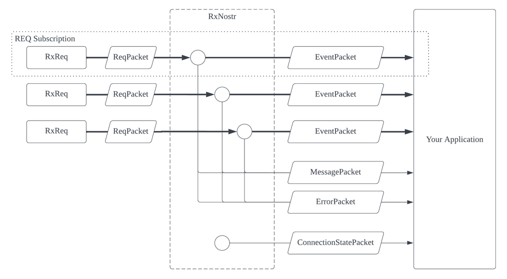

# First Step

rx-nostr の構造を理解するためには中心となる 3 種類の登場人物について知る必要があります。 それは [`RxReq`](/api/rx-req.md), [`RxNostr`](/api/rx-nostr.md)とあなたのアプリケーションです。rx-nostr の世界ではこれら 3 種類の登場人物の間を `RxReq -> RxNostr -> Your Appication` の単方向に **Packet** と呼ばれるデータが流れます。このデータの流れを詳しく見る前に、まずは `RxReq` と `RxNostr` が一体何者であるのかを確認しましょう。

`RxReq` は [REQ message](https://github.com/nostr-protocol/nips/blob/master/01.md#from-client-to-relay-sending-events-and-creating-subscriptions) を組み立てるために必要な情報 (**`ReqPacket`**) を `RxNostr` に送出するオブジェクトです。あなたは `RxReq` が提供するインターフェースを通じて間接的に REQ を発行することができます。ここで、`RxReq` はあくまで REQ message に必要な情報を提供するだけで、リレーとの交信を行うのは次に説明する `RxNostr` の役目であることに注意してください。

`RxNostr` は `ReqPacket` をもとに実際にリレーとの間に REQ サブスクリプションを確立し、これを管理します。あなたは `RxNostr` が提供するインターフェースを通じて、EVENT message をはじめとしたリレーからもたらされる各種の情報を Packet として受け取ることができます。

以上で簡単に述べた関係をより詳細に表したものが、次の図です。



図中の各要素を実際の JavaScript オブジェクトと対応させていきましょう。上記の図で、矢印は[`Observable<T>`](https://rxjs.dev/api/index/class/Observable)、矢印に重なる四辺形は `T` の実体、矢印の根本は Observable を返すことができるオブジェクト、矢印の指す先は Observer (言い換えれば、`subscribe()` を呼び出すオブジェクト) を示しています。

REQ Subscription と注釈された点線の枠に注目してください。今からこの枠で囲まれた太い矢印に対応する Observable を実際に生成・購読して、最小の Nostr アプリケーションを構築してみましょう！まずは Observable を次のようにして生成します。

```js{10-11}
import { createRxNostr, createRxForwardReq } from "rx-nostr";

const rxNostr = createRxNostr();
rxNostr.switchRelays([
  "wss://nostr-relay.nokotaro.com",
]);

const rxReq = createRxForwardReq();

// Create observable
const observable = rxNostr.use(rxReq);
```

もちろん、Observable は `subscribe()` されなければ意味がありません。ここでは受け取った Packet をログに吐き出すコードを追加することにしましょう。

```js{11-15}
import { createRxNostr, createRxForwardReq } from "rx-nostr";

const rxNostr = createRxNostr();
rxNostr.switchRelays(["wss://nostr-relay.nokotaro.com"]);

const rxReq = createRxForwardReq();

// Create observable
const observable = rxNostr.use(rxReq);

// Start subscription
const subscription = observable.subscribe((packet) => {
  // Your minimal application!
  console.log(packet);
});
```

14 行目の `console.log()` が、先程の図の右端のブロックに相当することになります。つまり、あなたのアプリケーションです！
しかしこのアプリケーションはまだ何も仕事をしないでしょう。なぜなら Packet が流れてこないからです。そう、REQ を発行しなければなりませんね。

```js{17-18}
import { createRxNostr, createRxForwardReq } from "rx-nostr";

const rxNostr = createRxNostr();
rxNostr.switchRelays(["wss://nostr-relay.nokotaro.com"]);

const rxReq = createRxForwardReq();

// Create observable
const observable = rxNostr.use(rxReq);

// Start subscription
const subscription = observable.subscribe((packet) => {
  // Your minimal application!
  console.log(packet);
});

// Send REQ message to listen kind1 events
rxReq.emit([{ kinds: [1] }]);
```

17, 18 行目を追加しました。さほど不思議なコードではないはずです。
これによって、`RxReq` は `RxNostr` に向かって `ReqPacket` をひとつ送出します。`RxNostr` は受け取った Packet をもとに REQ サブスクリプションを確立・購読し、購読されたイベントが 14 行目で消費されることになるでしょう。おめでとうございます！タイムラインを表示するアプリケーションの完成です！

ただ少し待ってください、最後にひと仕事だけ残っています。このままでは購読は永遠に続きます。CLOSE message を送出しなければなりません。rx-nostr では [`Subscription`](https://rxjs.dev/guide/subscription) を `unsubscribe()` するだけでこれを実現できます。10 秒後に CLOSE するようコードを追加しましょう。

```js{20-23}
import { createRxNostr, createRxForwardReq } from "rx-nostr";

const rxNostr = createRxNostr();
rxNostr.switchRelays(["wss://nostr-relay.nokotaro.com"]);

const rxReq = createRxForwardReq();

// Create observable
const observable = rxNostr.use(rxReq);

// Start subscription
const subscription = observable.subscribe((packet) => {
  // Your minimal application!
  console.log(packet);
});

// Send REQ message to listen kind1 events
rxReq.emit([{ kinds: [1] }]);

// Send CLOSE message in 10 seconds
setTimeout(() => {
  subscription.unsubscribe();
}, 10 * 1000);
```

完璧です！
